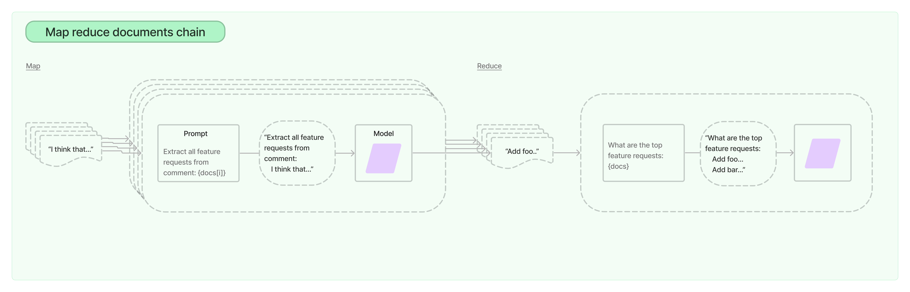

# Terms-Conditions-Comparison
This project utilises Large Language Models (LLMs) to summarise differences between two versions (2015 and 2023) of Apple's Terms and Conditions. 
The project is split into 4 parts:
1. Summarisation and comparison of the T&Cs.
2. Advice for standardising the T&Cs into a more consistent format.
3. Exploration of metrics applicable to quantify the quality of the summary.
4. Alternative methods and models for the task.

In order to achieve the primary goal of comparing the differences between the two T&Cs, I first summarised both versions and subsequently compared them.

## Summarisation 
**The code for this section can be found in `create_summaries.py`, outputs saved to `data/summaries`, and the map/reduce prompts saved in `prompts_templates`.**

Given two versions of Apple's T&CS (`data/raw`) I attempted to compare contextual differences between them. 

The 2015 version contained ~15,000 words (approximately 18,000 GPT-4 tokens), and the 2023 version approximately ~8000 words (10,000 GPT-4 tokens). This means that both versions exceeds the GPT-4 token limit of 8,192 (although could be stuffed into the GPT-4-32k model).
In order to get round the token limit I used [langchain](https://python.langchain.com/docs/get_started/introduction) to interact with the model. 

### Stuff

I attempted using the [stuff](https://python.langchain.com/docs/modules/chains/document/stuff) method, however this is better suited for smaller documents and didn't yield useful results (it essentially just said "these are Apple's T&Cs" - a little *too* summarised).

### Map reduce

I saw much better results with the [map-reduce](https://python.langchain.com/docs/modules/chains/document/map_reduce) method. Here, the LLM is supplied with a chunk of the document interatively and asked to summarise the chunk - `map`. The summaries are then combined and re-summarised in the `reduce` section. 





The prompts I used for this method can be found in  `prompts_templates/map_template.txt` and `prompts_templates/reduce_template.txt`.

Outputs can be found here
1. 2015 GPT-4: `data/summaries/gpt4_map_reduce_summarized_2015.txt`
2. 2023 GPT-4: `data/summaries/gpt4_map_reduce_summarized_2023.txt`
3. 2015 Davinci: `data/summaries/davinci_map_reduce_summarized_2015.txt`
4. 2023 Davinci: `data/summaries/davinci_map_reduce_summarized_2023.txt`

### Map Reduce over Sections
In an attempt to increase the amount of useful information captured by the summary, I manually split up the two T&Cs into sections and performed a map-reduce on both of them (`compare_summaries.map_reduce_sections_2015` and `compare_summaries.map_reduce_sections_2023`.) 

These outputs (`data/summaries/2015_sections_summary.txt`, `data/summaries/2023_sections_summary.txt`) seemed to contain more relevent information than previous attempts. 


### Vectors
This method was inspired by a [blog post](https://pashpashpash.substack.com/p/tackling-the-challenge-of-document). 
Here, the documents are split up and converted to word embeddings. A clustering algorithm then attempts to bucket pieces of text that are 'closer' to one another. After this, you can pull out the central point for each cluster and feed these into an LLM to produce your summary. 

The thinking here is that the clustering identifies the "key topics" within the document and re-assembles them onto a context-rich summary. 

This is essentially a automated way of creating document sections like above. 

I attempted this with mixed results (`data/summaries/vector_2015_summary.txt`, `data/summaries/vector_2023_summary.txt`) - it looks like it shows a lot of promise however I need more time to play around with the various chunk sizes and number of clusters. 

A key benefit of this approach of map-reduce is that the text is only fed into the LLM once, providing cost savings, whereas map-reduce can produce several calls to the LLM, adding up in price. 


## Summary Comparison
**Code for this section can be found in `compare_summaries.py`, and outputs in `data/summary_comparison`.**

Based on both human review and cosine distance (see Summary Metrics below) the "sections summaries" had performed best in the sumarisation task, and so these were used for comparison. 

With summaries of both the 2015 and 2023 contracts produced, I then utilised langchains document comparison [agent](https://python.langchain.com/docs/integrations/toolkits/document_comparison_toolkit) to compare the two summaries. 


This seemed to capture the differences well, however I also wanted to try prompt engineering for this part. For this I generated a prompt (`prompts_templates/prompt_engineering_comparison_prompt.txt`) that allowed both versions to be inputted, and asked GPT-4 (and davinci) for the key differences directly. 

The document comparison chain seemed to work best out of both these approaches. 

## Standardisation

**Code for this section can be found in `standardisation.py`, and outputs in `data/standardisation`.**

In order to produce advice on how the contracts can be standardised into a common format, I fed the "Sections summaries" into GPT-4 and created a prompt (`prompts_templates/standardisation_prompt.txt`) asking to create a standard format that captures all information in both summaries, I also asked the LLM to act as a legal expert with a specialty in contract law, which I found helped increase the quality of the result. 

## Summary Metrics
**Code for this section can be found in ```6_summary_metrics.ipynb```**

Industry standard metrics for determinig the quality of text summaries include [ROUGE](https://en.wikipedia.org/wiki/ROUGE_(metric)), [BLEU](https://en.wikipedia.org/wiki/BLEU) or a combination of both.

However these metrics have downfalls as they both use syntax to calculate their scores, rather than semantic meaning, 
For example the two sentences below have the same meaning, but score only 0.5 (out of 0 - 1) due to their differences in wording:
1. "The dog slept on the mat", 
2. "The canine snoozed on the rug"

A better metric may use word embeddings and cosine similarity to determine a score, as embeddings manage to capture contextual meaning over syntactic similarity. 

In the ```6_summary_metrics.ipynb``` notebook I first load in the full T&Cs for both 2015 and 2023. I then create word embeddings and score these in a ChromaDB vector database. 

I then loop through each version of the summary created in the previous section and create embeddings for each. 
Finally I calculate cosine distance scores for each summary against the entire text, with a lower score resulting in a more similar text. 

Final results are below:

| Model           | 2015         | 2023         |
| --------------- | ------------ | ------------ |
| sections        | 0.1315       | 0.1009       |
| bart            | 0.3278       | 0.1500       |
| davinci         | 0.1497       | 0.1691       |
| gpt             | 0.1340       | 0.1307       |
| vectors         | 0.2230       | 0.1967       |

As expected from human review, the model where sections are manually delineated produces the best summary. 

## Alternative models and methods
### Alternative Models

**Code for this section can be found in `4_huggingface_models.ipynb` and `5_traditional_methods.ipynb`.**

I attempted to use some open source models to create summaries, in order to compare to the OpenAI models. Initially I tried to use a model that was a version of BERT fine tuned on legal text (https://huggingface.co/nlpaueb/legal-bert-base-uncased) however this didn't work with HuggingFaceHub, and I don't have enough compute power to run it locally. 

I also tried a BART model from facebook, fine tuned on CNN news (https://huggingface.co/facebook/bart-large-cnn). I got this working to produce a summary but it had poor performance on longer text (like the input contracts).

### Traditional Methods
Before large language models, there were a number of traditional methods capable of summarisation. I implemented a few of this with the [sumy](https://miso-belica.github.io/sumy/) package with mixed results..

1. Lexrank - Worked okay and seemed to capture some key points, however not as performant as GPT

2. LSA - Seems to pull out random text without much context

3. Luhn - Seems to pull out random text without any context

4. KL-Sum - worse than Luhn

Although I didn't spend much time tuning these methods, they don't show a lot of promise over the use of LLMs. 
